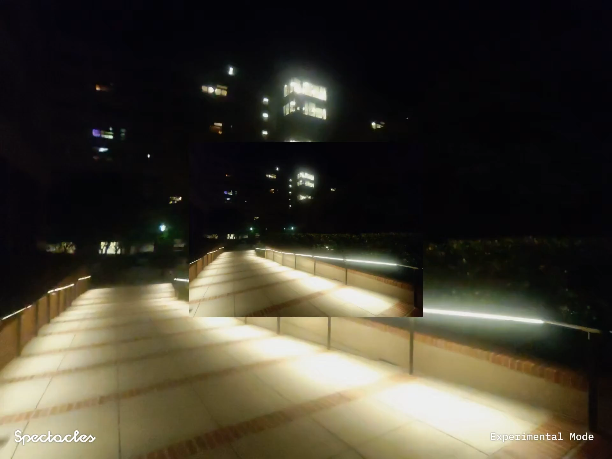

# Spectacle Music
[Here's our simple demo video.](https://www.youtube.com/watch?v=sDJ26lrEffc)

Hacked at LA Hacks, we created Spectacle Music. Spectacle Music transforms your surroundings into the perfect soundtrack. Using Spectacles, just snap a photo and our app understands the moment- and instantly get a personalized music recommendation wherever you are.

## Details
It's really hard to just make a music player like Youtube Music to play a song that's specific to the vibes and the environment around you at that moment. To truly feel those emotions through music at that time, it's hard. Spotify had an improved solution with their [Text2Tracks](https://research.atspotify.com/2025/04/text2tracks-improving-prompt-based-music-recommendations-with-generative-retrieval/) feature. But we wondered, what if you're using your Snap Spectacles and wanted to do the same thing?  

That's why we've used the SnapChat Spectacles to take a photo of your environment, enter it into Gemini 2.0 Flash-Lite Image Understanding for decoding the image and finally generating a song that best fits your environment. Immediately, your WebView would be updated with the new url to the song, and you can just play the song away with the pinch of the play button.

We used ContainerFrameUI, slide tracker, webhooks for Gemini API, and many other libraries in Lens Studio.

## Set Up Instructions
Setup in Snap Studio  
Connect to Spectacles
